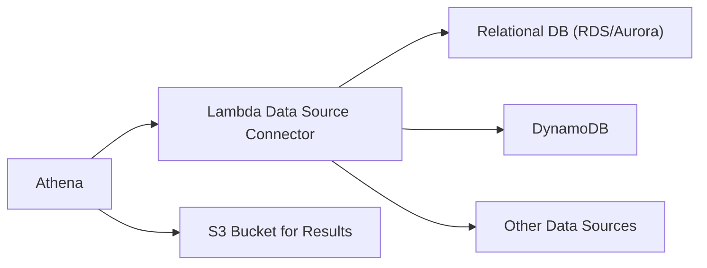

# Amazon Athena

## 1. 소개

Amazon Athena는 조직이 표준 SQL을 사용해 Amazon S3의 데이터를 직접 분석할 수 있게 해주는 완전관리형 서버리스 쿼리 서비스입니다. 서버나 클러스터를 설정하고 관리하는 복잡함을 없애, Amazon S3에 저장된 방대한 데이터셋에 대해 쉽게 애드혹 쿼리를 실행할 수 있게 해줍니다. 쿼리에 의해 스캔된 데이터에 대해서만 비용을 지불하므로 Athena는 비즈니스 인텔리전스와 분석을 위한 비용 효율적인 솔루션입니다. 비용 모델은 사용한 만큼 지불하는 방식으로 **스캔한 데이터 TB당 $5**로 가격이 책정됩니다. 결정적으로 성공하거나 취소된 쿼리만 청구 대상으로 계산됩니다. 실패한 쿼리는 청구되지 않으며, `CREATE`, `ALTER`, `DROP` 같은 **데이터 정의 언어(DDL)** 작업에는 요금이 부과되지 않습니다.

Athena의 핵심 강점은 ANSI SQL 지원, 다른 AWS 서비스와의 원활한 통합, JSON, CSV, Parquet, ORC 같은 다양한 데이터 형식을 쿼리하는 능력입니다. 이 유연성은 기술적, 비기술적 사용자 모두가 데이터 레이크에서 가치 있는 통찰을 효율적으로 추출할 수 있게 해줍니다. 애드혹 분석부터 대화형 대시보드 구축까지, Athena는 현대적인 데이터 분석을 위한 강력하고 다재다능한 도구를 제공합니다.

## 2. 핵심 기능과 역량

Amazon Athena는 강력하고 사용자 친화적인 분석 도구가 되게 하는 여러 핵심 기능을 갖추고 있습니다.

### 2.1. 서버리스 아키텍처

Athena의 서버리스 특성은 근본적인 이점입니다. 서버를 프로비저닝, 구성, 관리하는 운영 오버헤드를 피할 수 있습니다. Athena를 Amazon S3 버킷에 단순히 연결하기만 하면 즉시 데이터 쿼리를 시작할 수 있습니다. 이 설계는 쿼리 워크로드에 따른 자동 확장을 보장하고 운영 복잡성을 크게 줄여줍니다.

### 2.2. SQL 쿼리와 통합

ANSI SQL을 지원함으로써 Athena는 관계형 데이터베이스에 익숙한 누구에게나 접근 가능합니다. 이는 진입 장벽을 낮추고 데이터 분석에 표준 SQL 구문을 사용할 수 있게 해줍니다. 또한 다른 AWS 서비스와의 깊은 통합은 그 기능을 향상시킵니다.

- **Amazon QuickSight:** Athena 쿼리 결과에서 직접 대화형 대시보드와 시각화를 생성할 수 있게 해주어 데이터 탐색과 통찰 공유를 용이하게 합니다.
- **AWS Glue:** 중앙화된 메타데이터 관리를 위해 Glue Data Catalog와 통합되어, S3에 저장된 데이터의 스키마를 정의하고 관리할 수 있게 해줍니다.
- **AWS IAM:** 견고한 보안을 위해 IAM을 활용해, 데이터와 Athena 쿼리에 대한 세밀한 접근 제어를 가능하게 하고 데이터 거버넌스와 규정 준수를 보장합니다.
- **모니터링 도구(Amazon CloudWatch와 AWS CloudTrail):** 쿼리 성능 모니터링, 비용 추적, 보안 관련 이벤트 감사를 위한 도구를 제공해, 운영 가시성과 보안 관리를 향상시킵니다.

### 2.3. 다재다능한 데이터 형식 지원

Athena는 CSV, JSON, ORC, Apache Parquet 같은 열 기반 형식을 포함한 다양한 형식의 데이터를 직접 쿼리할 수 있습니다. 이는 사전 데이터 변환과 ETL 프로세스의 필요성을 없애줍니다. Athena가 여러 형식을 지원하지만, **ORC와 Apache Parquet 같은 열 기반 형식을 사용하는 것이 쿼리 비용을 30~90% 절감하고 성능을 크게 개선할 수 있으므로 강력히 권장됩니다.** 이는 열 기반 형식이 쿼리에 의해 스캔되는 데이터 양을 크게 줄이기 때문입니다.

### 2.4. 페더레이션 쿼리: 데이터 접근 확장

Amazon S3의 데이터를 쿼리하는 것을 넘어 Athena는 페더레이션 쿼리 기능을 제공합니다. 이를 통해 데이터 레이크를 넘어 다양한 데이터 소스에 있는 데이터에 원활하게 접근하고 분석할 수 있어, 효과적으로 데이터 사일로를 허물 수 있습니다. AWS Lambda 기반 데이터 소스 커넥터를 사용해 Athena는 다음을 쿼리할 수 있습니다.

- **관계형 데이터베이스:** Amazon RDS, Aurora, SQL Server 포함.
- **비관계형 데이터베이스:** Amazon DynamoDB와 DocumentDB 등.
- **온프레미스 데이터베이스:** 커스텀 커넥터의 개발과 사용을 통해.
- **다른 AWS 서비스:** Amazon CloudWatch Logs 등.

이 기능을 통해 서로 다른 소스 전반에서 데이터 분석을 통합해 데이터 환경에 대한 더 포괄적인 뷰를 만들 수 있습니다.



### 2.5. Athena Workgroups: 접근 정리와 제어

Athena Workgroups는 Athena 내에서 사용자, 팀, 애플리케이션, 워크로드를 정리하고 관리하는 강력한 방법을 제공합니다. 쿼리 접근과 비용 추적에 대한 세밀한 제어를 제공합니다. Workgroups의 핵심 기능은 다음을 포함합니다.

- **조직화**: 사용자와 워크로드를 논리적 그룹으로 구조화합니다.
- **접근 제어**: IAM과 통합해 워크그룹 수준에서 쿼리 접근을 제어합니다.
- **비용 추적**: 각 워크그룹과 관련된 쿼리 비용을 추적해 비용 가시성과 책임성을 향상시킵니다.
- **커스터마이징**: 각 워크그룹은 다음을 자체적으로 가질 수 있습니다.
    - **쿼리 이력**: 각 워크그룹별 별도의 쿼리 이력.
    - **데이터 한도**: 워크그룹 내에서 쿼리가 스캔할 수 있는 데이터 양을 제한하는 데이터 한도를 구현해 비용을 제어합니다.
    - **IAM 정책**: 세밀한 접근 제어를 가능하게 하기 위해 각 워크그룹에 특정 IAM 정책을 정의합니다.
    - **암호화 설정:** 다양한 보안 요구 사항을 충족하기 위해 워크그룹별로 별도의 암호화 설정을 구성합니다.
- **통합**: 인증과 권한 부여를 위한 IAM, 모니터링을 위한 CloudWatch, 알림을 위한 SNS와 원활하게 통합됩니다.

### 2.6. Apache Iceberg를 사용한 ACID 트랜잭션

Apache Iceberg 테이블 형식으로 구동되는 Athena는 **ACID(원자성, 일관성, 격리성, 지속성) 트랜잭션**을 지원합니다. 이 기능을 통해 동시 사용자가 Athena 내 데이터에 안전하게 행 수준 수정을 할 수 있습니다. ACID 트랜잭션을 활성화하려면 `CREATE TABLE` 명령에 `'table_type' = 'ICEBERG'`를 추가하기만 하면 됩니다.

Apache Iceberg를 통한 Athena의 ACID 트랜잭션의 주요 이점은 다음을 포함합니다.

- **동시 수정**: 데이터 손상 없이 여러 사용자가 안전하게 행 수준으로 수정합니다.
- **호환성**: EMR과 Spark 같이 Iceberg 테이블 형식을 지원하는 다른 서비스와 호환됩니다.
- **단순화된 데이터 관리**: 커스텀 레코드 잠금 메커니즘의 필요성을 제거합니다.
- **타임 트래블**: `SELECT` 문을 사용해 최근 삭제된 데이터를 복구할 수 있는 타임 트래블 작업을 가능하게 해, 데이터 복구와 감사 기능을 제공합니다.
- **성능**: 시간이 지남에 따라 쿼리 성능을 유지하기 위한 주기적인 압축의 이점을 누립니다.

이 접근 방식은 Lake Formation의 거버넌스 테이블과 유사하게 Athena에서 ACID 속성을 달성하는 또 다른 방법을 제공해, 특정 요구에 따라 올바른 접근 방식을 선택하는 유연성을 제공합니다.

## 3. Amazon Athena 작동 방식: 스키마 온 리드(Schema-on-Read)

Athena는 Presto를 기반으로 한 분산 SQL 엔진을 사용해 쿼리를 처리합니다. "스키마 온 리드" 원칙에 따라 작동합니다. 이는 데이터 로딩이나 수집 중이 아니라 쿼리를 실행할 때 스키마와 데이터 유형을 정의한다는 것을 의미합니다. 이 접근 방식은 전통적인 ETL 프로세스와 관련된 지연 없이 S3의 원시 데이터를 신속하게 분석할 수 있는 상당한 민첩성을 제공합니다.

서비스 워크플로는 Amazon S3에서 직접 데이터를 읽고, 분산된 노드 클러스터 전반에서 병렬로 처리한 다음, 쿼리 결과를 반환하는 것을 포함합니다. Athena는 확장, 리소스 할당, 쿼리 최적화를 배후에서 자동으로 처리해, 사용자로부터 인프라 관리 복잡성을 추상화합니다.

## 4. 성능과 비용 최적화 전략

Athena는 쿼리당 스캔된 데이터 양(**TB당 $5**)을 기반으로 요금을 부과하므로 비용 효율성과 속도를 위해 쿼리 성능 최적화가 필수적입니다. AWS가 권장하는 다음 전략을 구현하면 Athena 쿼리 성능을 크게 개선하고 비용을 줄일 수 있습니다.

### 4.1. 열 기반 데이터 형식 활용

Apache Parquet나 ORC 같은 열 기반 형식으로 데이터를 저장하는 것은 주요 최적화 기법입니다. Athena가 전체 행을 처리하는 대신 쿼리에 지정된 열만 읽기 때문에 이러한 형식은 스캔되는 데이터를 크게 줄여줍니다. **이는 쿼리 비용을 30~90% 절감하고 성능을 개선할 수 있습니다.** 열 기반 형식을 선택하는 것은 Athena 비용을 최적화하는 가장 영향력 있는 방법 중 하나입니다.

### 4.2. 데이터 압축 구현

데이터셋을 압축하면 스토리지 공간과 Athena가 스캔해야 하는 데이터 양이 모두 줄어듭니다. 압축 기법은 Athena와 완전히 호환되며 데이터 양을 최소화함으로써 쿼리 성능에서 상당한 개선을 가져올 수 있습니다.

### 4.3. 데이터 파티셔닝 사용

날짜나 지리적 지역 같은 논리적 카테고리를 기반으로 데이터를 파티셔닝하면 Athena가 관련 파티션만 쿼리할 수 있습니다. 쿼리에 파티션 필터(예: `WHERE year='2023'`)가 포함되면 Athena는 지능적으로 지정된 파티션 내의 데이터만 스캔해, 스캔된 데이터와 쿼리 실행 시간을 극적으로 줄입니다. 일반적인 파티셔닝 스킴은 다음과 같이 날짜 기반 파티셔닝을 포함합니다.

```
s3://your-bucket/flightdata/
└── year=1991/
    └── month=01/
        └── day=01/
```

### 4.4. 더 큰 파일로 통합

S3에 대량의 작은 파일로 데이터를 저장하면 쿼리 실행 중 오버헤드가 발생할 수 있습니다. 작은 파일을 더 큰 파일(이상적으로는 128MB 이상)로 통합하면 수많은 파일을 처리하는 것과 관련된 오버헤드를 줄여 스캔 효율성과 전체 쿼리 성능을 개선합니다.

## 5. 안티패턴: Athena를 사용하지 말아야 할 때

Athena는 강력하지만 모든 사용 사례에 적합한 것은 아닙니다. 다음에는 Athena 사용을 피하세요.

- **고도로 형식화된 보고서와 시각화**: Athena는 데이터 쿼리와 분석을 위해 설계되었습니다. 고도로 형식화된 보고서와 대화형 시각화를 만드는 데는 **Amazon QuickSight가 더 적절한 서비스입니다.**
- **ETL(추출, 변환, 로드) 작업**: Athena는 쿼리 내에서 변환을 수행할 수 있지만 무거운 ETL 워크로드를 위해 설계되지 않았습니다. **AWS Glue는 ETL 작업**과 데이터 준비 태스크를 위한 전용 서비스로, 데이터 변환과 이동을 위한 견고한 기능을 제공합니다.

올바른 작업에 올바른 도구를 사용하면 AWS 생태계 내에서 효율성과 비용 효과성을 보장할 수 있습니다.

## 6. 결론

Amazon Athena는 Amazon S3 내의 대용량 데이터셋을 직접 쿼리하기 위한 견고하고, 적응력 있고, 비용 효율적인 서비스로 두드러집니다. 서버리스 아키텍처는 인프라 관리를 없애주고, 표준 SQL 준수와 AWS 생태계와의 긴밀한 통합은 데이터 분석 워크플로를 단순화하고 간소화합니다. 애드혹 조사부터 정교한 데이터 대시보드 구축과 다양한 소스의 데이터 통합까지, 스키마 온 리드 유연성, 페더레이션 쿼리, 조직을 위한 Workgroups, ACID 트랜잭션을 포함한 Athena의 광범위한 기능은 현대적인 데이터 분석을 위한 필수적인 자산으로 자리매김합니다. Athena의 비용 효율성을 활용하려면 데이터 형식과 쿼리 패턴을 최적화하고, 특정 작업에 맞는 AWS 서비스를 선택하는 것을 잊지 마세요 — 시각화에는 QuickSight를, ETL에는 Glue를 사용하세요.

최신 정보와 상세한 안내는 [Amazon Athena 제품 페이지](https://aws.amazon.com/athena/)와 포괄적인 [Amazon Athena 문서](https://docs.aws.amazon.com/athena/latest/ug/what-is.html)를 참고하세요.
