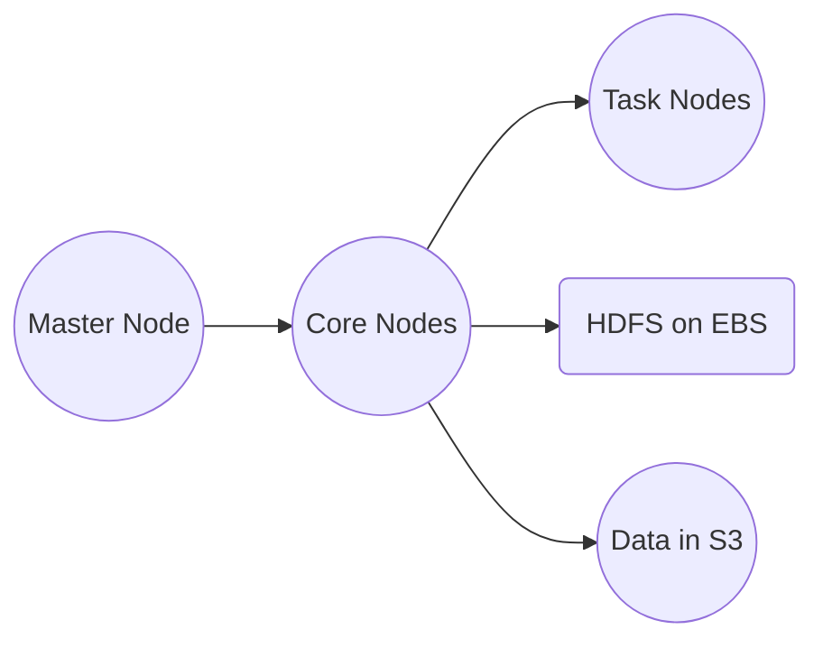

# Amazon EMR

## 1. 소개

Amazon EMR은 Apache Hadoop, Spark, Hive, HBase, Presto 등의 프레임워크를 실행하는 클러스터를 관리함으로써 대규모 분산 데이터 처리를 단순화하는 클라우드 기반 서비스입니다. 이 서비스는 하드웨어 관리와 소프트웨어 구성의 복잡함을 추상화해, 인프라 세부 사항이 아니라 데이터 통찰에 집중할 수 있게 해줍니다. EMR의 관리형 특성은 신속한 데이터 처리, 자동 확장, 다른 AWS 서비스와의 통합을 가능하게 해, 현대적인 빅데이터 아키텍처의 초석이 됩니다.

## 2. 핵심 개념과 아키텍처

### 2.1 빅데이터 생태계

EMR의 핵심에는 대용량 데이터셋의 분산 저장과 처리를 위해 설계된 오픈소스 도구 모음인 Hadoop 생태계가 있습니다. Hadoop 외에도 EMR은 다음을 지원합니다.

- **Apache Spark:** 빠른 인메모리 분석과 머신 러닝을 위한 도구.
- **Apache Hive:** SQL과 유사한 쿼리를 위한 도구.
- **Apache HBase:** 실시간 읽기/쓰기 접근을 위한 도구.
- **Presto와 Apache Flink:** 대화형 분석과 스트림 처리를 위한 도구.

이 생태계는 단일 EMR 클러스터로 다양한 데이터 처리 파이프라인을 구축할 수 있게 해줍니다.
### 2.2 EMR 아키텍처와 노드 유형

EMR 클러스터는 일반적으로 Amazon Virtual Private Cloud(VPC) 내에 배포되며 세 가지 주요 노드 유형으로 구성됩니다.

- **마스터 노드:**
    클러스터 작업을 조율하고, 태스크를 할당하며, 클러스터를 관리하기 위해 지속적으로 실행되어야 합니다.
- **코어 노드:**
    연결된 Amazon EBS 볼륨에서 HDFS를 사용해 데이터를 저장하고 처리 태스크의 대부분을 수행합니다. 신뢰성과 지속적인 운영을 위해 설계되었습니다.
- **태스크 노드:**
    데이터를 유지하지 않으면서 추가적인 처리 능력을 제공합니다. 워크로드 요구에 따라 동적으로 확장하거나 축소할 수 있습니다.

일시적인 HDFS를 넘어선 영구적이고 내구성 있는 스토리지를 위해 EMR은 EMRFS를 통해 Amazon S3와 통합되어, 여러 가용 영역(AZ)에 걸쳐 데이터가 복제되도록 보장합니다.

아래는 일반적인 EMR 클러스터 구성의 간소화된 시각화입니다.

이 설계 패턴 — 고성능 임시 스토리지를 위해 HDFS를 사용하고 장기 내구성을 위해 S3를 사용하는 것 — 은 많은 EMR 배포의 기본입니다.
## 3. 핵심 기능과 역량

### 3.1 관리형 클러스터 플랫폼

- **단순화된 관리:**
    EMR은 클러스터 설정, 구성, 튜닝을 자동화합니다. AWS Management Console, CLI, 또는 SDK를 사용해 클러스터를 시작할 수 있어 운영 부담을 줄여줍니다.
    
- **동적 확장:**
    처리 요구에 맞춰 노드를 자동으로 추가하거나 제거해 최적의 성능과 비용 효율성을 보장합니다.
    
### 3.2 여러 프레임워크 지원

EMR은 광범위한 오픈소스 빅데이터 프레임워크를 네이티브로 지원해, 단일 클러스터 내에서 배치 처리와 대화형 쿼리부터 머신 러닝과 실시간 분석까지 다양한 애플리케이션을 실행할 수 있게 해줍니다.

### 3.3 AWS 생태계와의 통합

- **스토리지와 데이터 내구성:**
    내구성 있는 다중 AZ 스토리지를 위해 EMRFS를 사용해 Amazon S3와 원활하게 통합하고, 빠른 임시 데이터 저장을 위해 EBS의 HDFS를 활용합니다.
    
- **보안과 네트워킹:**
    세밀한 제어를 위해 AWS Identity and Access Management(IAM)를 활용하고, 안전한 네트워킹을 위해 Amazon VPC 내에서 클러스터를 실행하며, 저장 중과 전송 중 암호화로 데이터를 보호합니다.
    
- **모니터링과 로깅:**
    EMR은 성능 모니터링과 문제 해결을 위한 실시간 지표와 로그를 전달하기 위해 Amazon CloudWatch와 통합됩니다.

## 4. 통합과 데이터 처리

### 4.1 Amazon S3를 위한 EMRFS

EMRFS는 (Hive, Spark, MapReduce 같은) Hadoop 기반 애플리케이션이 Amazon S3에서 원활하게 읽고 쓸 수 있게 해주는 전문화된 커넥터입니다. 이 통합은 S3의 다중 AZ 중복성을 활용해 데이터 내구성과 고가용성을 보장합니다.
### 4.2 추가 통합

- **DynamoDB 통합:**
    EMR은 DynamoDB에서 데이터를 가져올 수 있어, NoSQL 데이터베이스에 저장된 데이터에 대한 분석과 보고를 가능하게 합니다.
    
- **AWS Glue와 다른 서비스:**
    데이터 카탈로깅과 ETL 프로세스를 위해 AWS Glue와, 다운스트림 데이터 웨어하우징과 분석을 위해 Amazon Redshift나 RDS와 통합합니다.

이러한 통합은 EMR을 다양한 빅데이터 워크플로를 위한 유연한 허브로 만들어줍니다.
## 5. 비용 최적화와 인스턴스 구매 옵션

### 5.1 EMR 노드 구매 옵션

잠재적으로 큰 클러스터의 비용을 관리하는 것은 매우 중요합니다. EMR은 서로 다른 노드 역할에 맞춰진 여러 구매 옵션을 제공합니다.

- **온디맨드 인스턴스:**
    예측 가능한 성능과 고가용성을 제공해, 일관된 가동 시간이 필요한 마스터와 코어 노드에 이상적입니다.
    
- **예약 인스턴스:**
    1년 또는 다년 약정을 통해 장기 실행 클러스터에 상당한 비용 절감을 제공합니다.
    
- **스팟 인스턴스:**
    더 낮은 가격으로 여유 EC2 용량을 활용해, 중단을 감내할 수 있는 태스크 노드에 가장 적합합니다.
### 5.2 인스턴스 구성: 그룹 vs. 플릿

- **균일한 인스턴스 그룹:**
    노드 유형당 하나의 인스턴스 유형과 구매 옵션을 지정하며, 워크로드가 변동함에 따라 자동 확장을 위한 내장 지원을 제공합니다.
    
- **인스턴스 플릿:**
    온디맨드와 스팟 카테고리에 걸쳐 여러 인스턴스 유형을 혼합할 수 있게 해주어, 지정된 용량을 목표로 하면서 비용과 가용성을 모두 최적화하는 유연성을 제공합니다.

## 6. 배포 옵션: 장기 실행 vs. 일시적 클러스터

- **장기 실행 클러스터:**
    지속적인 데이터 처리나 온디맨드 분석에 이상적입니다. 이 클러스터는 장기간에 걸친 비용 효율성을 보장하기 위해 마스터와 코어 노드에 예약 인스턴스를 사용하는 데서 이점을 얻습니다.
    
- **일시적 클러스터:**
    배치 작업이나 계절적 워크로드에 적합하며, 필요할 때 시작해 처리 완료 후 자동으로 종료되어 비용을 최소화합니다.
## 7. 결론

Amazon EMR은 관리형 인프라, 다중 프레임워크 지원, AWS 생태계와의 긴밀한 통합을 결합해 현대적인 빅데이터 과제를 위한 포괄적인 솔루션을 제공합니다. 지속적인 분석을 위해 장기 실행 클러스터를 배포하든 배치 처리를 위해 일시적 클러스터를 배포하든, EMR의 유연한 아키텍처, 비용 효율적인 구매 옵션, 견고한 보안 기능은 조직이 방대한 데이터셋에서 실행 가능한 통찰을 추출할 수 있게 해줍니다.

더 자세한 내용과 최신 업데이트는 다음의 공식 자료를 참고하세요.

- **Amazon EMR 제품 페이지:** [aws.amazon.com/emr](https://aws.amazon.com/emr/)
- **Amazon EMR 문서:** [docs.aws.amazon.com/emr](https://docs.aws.amazon.com/emr/)
- **Amazon EMR FAQ:** [aws.amazon.com/emr/faqs](https://aws.amazon.com/emr/faqs/)

이 장에서 설명한 개념을 이해하고 적용함으로써 Amazon EMR을 사용해 안전하고, 확장 가능하고, 비용 효율적인 방식으로 빅데이터 처리 워크플로를 최적화할 준비를 갖추게 됩니다.
