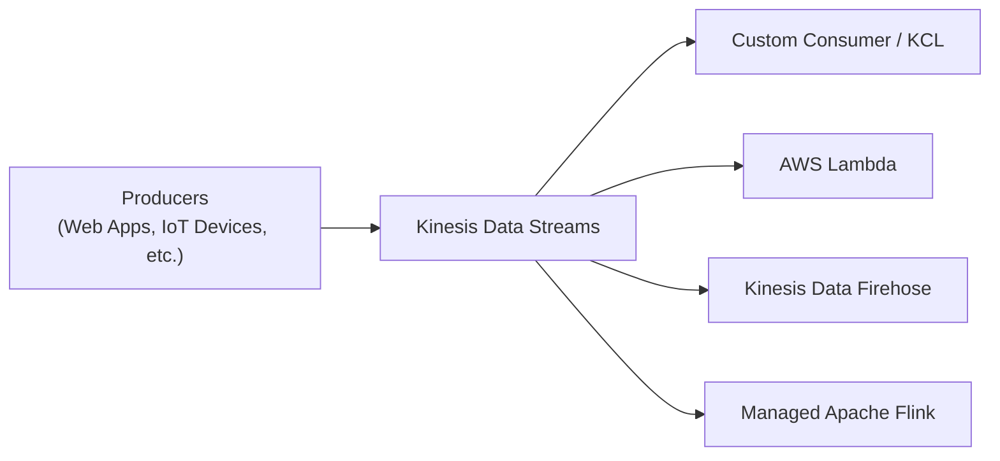

# Amazon Kinesis Data Streams

## 1. 소개

Amazon Kinesis Data Streams는 스트리밍 데이터를 실시간으로 수집, 처리, 분석하도록 설계된 완전관리형이고 확장 가능한 서비스입니다. 웹사이트 클릭스트림, IoT 장치, 시스템 로그 같은 다양한 소스에서 높은 처리량의 데이터를 캡처해 실시간 분석, 모니터링, 운영 대시보드에 즉시 사용할 수 있게 해줍니다. 내구성, 신속한 수집, 거의 즉각적인 처리를 결합함으로써 Kinesis Data Streams는 지속적인 통찰과 즉각적인 대응이 필요한 현대적인 데이터 아키텍처를 뒷받침합니다.

## 2. 실시간 데이터와 사용 사례

실시간 데이터는 이벤트가 발생함에 따라 생성되고 소비되는 정보입니다. 이 즉시성은 애플리케이션이 변화하는 조건에 몇 초 — 심지어 밀리초 — 내에 반응할 수 있게 해줍니다. 일반적인 실시간 데이터 시나리오는 다음을 포함합니다.

- **웹사이트 클릭스트림:** 사용자 행동을 모니터링하기 위해 클라이언트 측 애플리케이션에서 직접 캡처됩니다.
- **IoT 텔레메트리:** 스마트 장치, 산업 장비, 커넥티드 차량에서 스트리밍되는 센서 데이터.
- **시스템 로그와 지표:** 운영 알림과 성능 대시보드를 구동하기 위해 서버와 애플리케이션에서 집계됩니다.

이러한 사용 사례는 Kinesis Data Streams가 동적 가격 책정, 자동화된 알림, 실시간 대시보드, 정교한 분석 파이프라인을 가능하게 하며, 데이터가 도착하는 즉시 처리해야 하는 애플리케이션을 어떻게 지원하는지 보여줍니다.
## 3. 핵심 개념과 아키텍처

Kinesis Data Streams에 대한 견고한 이해는 핵심 구성 요소와 용어에서 시작됩니다. 다음 섹션들은 이 서비스가 높은 처리량의 실시간 데이터 수집과 처리를 위해 어떻게 아키텍처화되어 있는지 상세히 설명합니다.

### 3.1. 데이터 레코드와 스트림

- **데이터 레코드:**
    스트림에 저장되는 기본 단위로, 각 데이터 레코드는 데이터 블롭(불변 바이트 시퀀스), 파티션 키(레코드를 그룹화하는 데 사용되는 유니코드 문자열), 샤드 내에서 레코드를 고유하게 식별하는 시퀀스 번호로 구성됩니다. 레코드는 최대 1MB까지 가능해 다양한 데이터 페이로드를 허용합니다.
- **데이터 스트림:**
    데이터 레코드의 논리적 그룹화로, 스트림은 하나 이상의 샤드로 구성됩니다. 생산자가 시스템으로 밀어 넣는 데이터의 지속적인 흐름을 나타냅니다.
### 3.2. 샤드와 파티셔닝

- **샤드:**
	샤드는 고유하게 식별되는 고정 용량의 데이터 레코드 시퀀스입니다. 스트림의 처리량을 위한 기본 단위 역할을 하며, 각 샤드는 지정된 쓰기와 읽기 속도를 지원합니다. 스트림의 전체 용량은 샤드 수에 따라 선형으로 확장됩니다.
    
- **파티션 키와 시퀀스 번호:**
    각 레코드의 파티션 키는 (MD5를 사용해) 해싱되어 어떤 샤드가 레코드를 받을지 결정합니다. 샤드 내에서 데이터 수집 후 할당되는 시퀀스 번호는 주어진 파티션 키에 대한 레코드의 순서를 유지합니다. 이 순서는 시계열이나 이벤트 기반 데이터의 순차적 특성에 의존하는 애플리케이션에 매우 중요합니다.
### 3.3. 생산자와 데이터 수집

Kinesis Data Streams로 데이터를 밀어 넣는 애플리케이션이나 장치를 생산자라고 합니다. 여기에는 다음이 포함될 수 있습니다.
- **커스텀 애플리케이션:** 웹 클라이언트, 모바일 장치, 백엔드 시스템에서 실행되는 코드.
- **Kinesis 에이전트:** 로그나 지표를 캡처하기 위해 서버에 배포되는 경량 프로세스.
- **Kinesis Producer Library(KPL):** 높은 처리량의 워크로드를 위해 데이터 레코드를 효율적으로 배치 처리하고 전송하는 클라이언트 측 라이브러리.

레코드를 효율적으로 배치 처리하고 재시도를 관리함으로써 생산자는 데이터가 스트림에 신뢰성 있게 수집되도록 보장합니다.
### 3.4. 소비자와 데이터 처리

스트림에서 데이터를 처리하는 애플리케이션을 소비자라고 합니다. 이들은 레코드를 거의 실시간으로 검색하고 처리하며, 여러 방식으로 구현될 수 있습니다.
- **Kinesis Client Library(KCL):** 여러 애플리케이션 인스턴스에 걸쳐 내결함성이 있고 부하가 분산된 데이터 소비를 제공합니다.
- **AWS Lambda:** 서버를 프로비저닝하지 않고 이벤트 기반 처리를 가능하게 합니다.
- **다른 AWS 서비스:** 상태 기반 스트림 처리를 위한 Amazon Managed Service for Apache Flink나 스토리지와 분석 대상으로의 데이터 전달을 위한 Amazon Data Firehose 등.

Kinesis Data Streams의 설계는 여러 소비자가 동일한 스트림을 동시에 처리할 수 있게 해줍니다 — 향상된 팬아웃 기능을 사용할 때는 각각 전용 처리량을 가집니다.

### 3.5. 데이터 보존과 순서

- **데이터 보존:**
    Kinesis Data Streams는 기본적으로 24시간 동안 데이터 레코드를 보존합니다. 그러나 디버깅, 과거 분석, 또는 내결함성 처리를 위한 중요한 기능인 이벤트의 재처리나 재생을 허용하기 위해 이 보존 기간을 최대 365일(8760시간)까지 연장할 수 있습니다.
- **순서대로 소비:**
    동일한 파티션 키를 가진 레코드는 순서대로 전달되어, (트랜잭션 로그나 센서 판독값 같은) 시간에 민감한 시퀀스가 시간순 무결성을 유지하도록 보장합니다.
## 4. 용량 모드

Kinesis Data Streams는 다양한 워크로드 요구와 비용 고려 사항에 맞추기 위해 두 가지 용량 모드를 제공합니다.
### 4.1. 프로비저닝 모드

- **용량 관리:**
    스트림의 샤드 수를 명시적으로 프로비저닝합니다. 각 샤드는 다음을 제공합니다.
    - 쓰기의 경우 최대 1MB/s(또는 초당 1,000개 레코드).
    - 읽기의 경우 최대 2MB/s.
- **확장:**
    수동 확장이 필요합니다. 처리량 용량을 조정하기 위해 샤드를 분할하거나 병합할 수 있습니다.
- **가격 정책:**
    프로비저닝된 샤드당 시간별로 청구됩니다.

>**시험 팁:** 프로비저닝 모드는 예측 가능한 트래픽이 수동 용량 조정을 허용하는 시나리오에서 자주 강조됩니다.
### 4.2. 온디맨드 모드

- **자동 확장:**
    서비스는 수동 개입 없이 관찰된 트래픽 패턴을 기반으로 용량을 동적으로 조정합니다.
- **가격 정책:**
    고정된 샤드 수가 아니라 수집되고 검색된 데이터 양을 기반으로 요금이 청구됩니다.
- **사용 사례:**
    트래픽 패턴이 매우 가변적이거나 예측할 수 없을 때 온디맨드 모드가 이상적입니다.
## 5. 보안

Amazon Kinesis Data Streams의 보안은 여러 계층에서 시행됩니다.
- **전송 중인 데이터:**
    모든 데이터는 HTTPS를 사용해 안전하게 전송되어 전송 중 암호화를 보장합니다.
- **저장 중인 데이터:**
    Kinesis는 저장된 데이터를 보호하기 위해 AWS Key Management Service(KMS)를 사용한 서버 측 암호화를 지원합니다.
- **책임 공유 모델:**
    AWS는 기본 인프라 보안(클라우드 자체의 보안)을 책임지고, 여러분은 접근 정책 구성, 암호화 키 관리, 애플리케이션이 필요한 권한을 갖도록 보장(클라우드 내 보안)할 책임이 있습니다.

이러한 조치는 스트리밍 데이터의 기밀성과 무결성을 보장하는 데 도움을 줍니다.
## 6. 모니터링과 문제 해결

효과적인 모니터링은 높은 처리량의 데이터 스트림을 운영하는 데 매우 중요합니다. Kinesis Data Streams는 실시간 운영 통찰을 제공하기 위해 여러 AWS 서비스와 통합됩니다.

- **CloudWatch 지표:**
    상세한 커스텀 지표는 스트림 처리량, 지연 시간, 데이터 소비에 대한 통찰을 제공합니다.
- **Kinesis 에이전트:**
    이 도구는 로그와 지표 데이터가 올바르게 캡처되고 전달되도록 보장하는 데 도움이 되는 추가 지표를 게시할 수 있습니다.
- **API 로깅과 CloudTrail:**
    API 호출의 로깅은 문제 해결에 도움을 주고 스트림 작업에 대한 감사 추적을 제공합니다.
- **KCL 지표:**
    Kinesis Client Library는 샤드별, 소비자별 지표를 집계해 처리 병목 현상의 식별과 해결을 용이하게 합니다.
## 7. 통합과 예시 아키텍처

Kinesis Data Streams는 다양한 AWS 서비스와 서드파티 도구와 원활하게 통합되도록 설계되었습니다. 일반적인 통합은 다음을 포함합니다.
- **데이터 전달:**
    Kinesis Data Firehose는 스트리밍 데이터를 Amazon S3, Amazon Redshift, 또는 Amazon OpenSearch로 자동으로 로드할 수 있습니다.
- **실시간 분석:**
    AWS Lambda나 관리형 Apache Flink에 구축된 소비자는 스트림 데이터에 대한 지속적인 분석을 수행할 수 있습니다.
- **데이터 저장과 처리:**
    처리된 데이터는 장기 저장과 분석을 위해 Amazon DynamoDB, Amazon RDS, 또는 다른 데이터 저장소로 추가로 통합될 수 있습니다.

다음 다이어그램은 생산자에서 여러 소비자 엔드포인트로의 데이터 개념적 흐름을 보여줍니다.

이 아키텍처는 생산자가 스트림에 실시간 이벤트를 게시하고, 여기서 다양한 소비자가 데이터를 동시에 그리고 독립적으로 처리할 수 있는 방법을 보여줍니다.
## 8. 서비스 한도와 가격 정책

- **서비스 한도:**
    각 AWS 계정은 스트림의 확장성을 결정하는 (리전당 최대 샤드 수 같은) 특정 할당량을 가지고 있습니다. 이러한 한도는 종종 요청을 통해 늘릴 수 있습니다.
- **가격 정책 모델:**
    가격 정책은 선택한 용량 모드에 따라 다릅니다. 프로비저닝 모드에서는 프로비저닝된 샤드 수를 기반으로 청구되고, 온디맨드 모드에서는 수집되고 검색된 데이터 양을 기반으로 가격이 책정됩니다. 확장된 데이터 보존과 (팬아웃 같은) 향상된 기능은 추가 비용이 발생할 수 있습니다.
## 9. 결론

Amazon Kinesis Data Streams는 실시간 데이터 수집과 처리를 위한 포괄적인 플랫폼을 제공합니다. 유연한 용량 모드, 견고한 보안, 다른 AWS 서비스와의 깊은 통합을 제공함으로써, 조직이 반응적이고 확장 가능한 데이터 아키텍처를 구축할 수 있게 해줍니다. 대용량 클릭스트림 데이터를 캡처하든, IoT 장치를 모니터링하든, 로그와 지표를 실시간으로 처리하든, Kinesis Data Streams는 현대적인 스트리밍 애플리케이션에 필요한 내구성, 속도, 운영 단순성을 제공합니다.

효율적인 데이터 수집을 위해 Kinesis Producer Library(KPL)를 사용하고 내결함성 있는 소비를 위해 Kinesis Client Library(KCL)를 사용하는 것 같은 모범 사례를 활용함으로써, 지속적이고 실시간인 통찰을 지원하는 견고한 시스템을 만들 수 있어 — 새로운 정보에 즉시 반응할 수 있는 능력을 비즈니스에 부여합니다.
