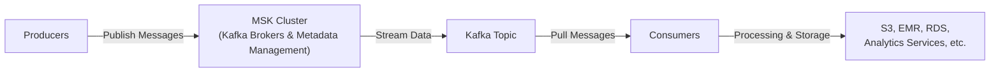

# Amazon Managed Streaming for Apache Kafka(Amazon MSK)

## 1. 소개

Amazon MSK는 스트리밍 데이터를 처리하기 위해 Apache Kafka를 사용하는 애플리케이션을 쉽게 구축하고 실행할 수 있게 해주는 완전관리형 서비스입니다. Amazon MSK를 사용하면 AWS가 Apache Kafka 클러스터를 프로비저닝, 운영, 확장하는 것과 관련된 많은 작업을 처리해줍니다 — 인프라 관리가 아니라 애플리케이션 로직에 집중할 수 있게 해줍니다. Kafka의 오픈소스 API로 구축된 애플리케이션은 Amazon MSK와 원활하게 작동하므로 코드 변경 없이 기존 도구와 통합을 활용할 수 있습니다.

## 2. Amazon MSK의 핵심 기능

- **완전관리형**: AWS가 기본 인프라(브로커, ZooKeeper, 스토리지)를 관리합니다.
- **고가용성**: 클러스터는 복원력을 위해 여러 가용 영역에 걸쳐 있을 수 있습니다.
- **손쉬운 확장**: 컴퓨팅과 스토리지 리소스는 워크로드 요구에 따라 확장될 수 있습니다.
- **영구적인 데이터 저장**: 필요한 만큼 오래 Amazon EBS 볼륨에 스트리밍된 데이터를 유지합니다.
- **다양한 소비 옵션**: 네이티브 Kafka 소비자나 Lambda, AWS Glue, Kinesis Data Analytics for Apache Flink 같은 AWS 서비스와 MSK를 통합합니다.

## 3. 아키텍처와 구성 요소

다음 다이어그램은 MSK 클러스터 내 데이터의 흐름과 핵심 구성 요소를 보여줍니다.

**브로커와 ZooKeeper:**
- **브로커**는 스트리밍 데이터를 저장하고 읽기/쓰기 요청을 처리하는 Kafka 서버입니다.
- **ZooKeeper**는 클러스터 조율, 리더 선출, 다른 관리 작업을 관리합니다.
- MSK는 내결함성을 위해 가용 영역 전반에 걸쳐 이 노드들을 자동으로 생성하고 관리합니다.

**토픽과 파티션:**
- 데이터는 **토픽**으로 구성되며, 이는 다시 **파티션**으로 분할됩니다.
- 생산자는 특정 토픽에 메시지를 작성하고, 파티션은 부하 분산에 도움을 줍니다.
- 소비자는 특정 파티션에서 메시지를 가져와 병렬 처리를 가능하게 합니다.
## 4. 통합과 사용 사례
### 4.1. MSK로 데이터 생산하기

생산자는 전통적인 Kafka 환경과 매우 유사하게 MSK로 데이터를 공급합니다. 다양한 언어로 Kafka 생산자 클라이언트를 구축할 수 있습니다. 데이터는 일반적으로 IoT 장치, 데이터베이스, 스트리밍 시스템 같은 소스에서 옵니다.

- **Kafka Producer Library**: 선호하는 프로그래밍 언어로 Kafka의 네이티브 생산자 라이브러리를 사용합니다.
- **Kinesis**: 원한다면 외부 AWS 서비스를 통합하거나 Kinesis에서 데이터를 수집해 MSK로 전달할 수 있습니다.

### 4.2. MSK에서 데이터 소비하기

데이터가 MSK에 들어오면 여러 소비자가 Kafka 토픽에서 데이터를 가져올 수 있습니다. 일반적인 소비 패턴은 다음을 포함합니다.

1. **Kinesis Data Analytics for Apache Flink**: 실시간 데이터에 대해 스트리밍 SQL이나 대규모 데이터 분석을 실행합니다.
2. **AWS Glue**: ETL 작업은 Apache Spark Streaming 기능을 사용해 Kafka에서 읽을 수 있습니다.
3. **AWS Lambda**: 더 단순한 이벤트 기반 처리를 위해 MSK에서 직접 Lambda 함수를 트리거합니다.
4. **네이티브 Kafka 소비자**: 표준 Kafka 소비자 라이브러리를 사용해 Amazon EC2, Amazon ECS, 또는 Amazon EKS에 배포됩니다.

### 4.3. MSK 서버리스

서버리스 MSK는 Kafka 클러스터의 용량을 수동으로 프로비저닝하고 관리할 필요를 없애줍니다. 워크로드에 따라 컴퓨팅과 스토리지를 자동으로 확장해 운영을 더욱 단순화합니다. **이는 예측할 수 없거나 급증하는 워크로드에 특히 유용할 수 있습니다.**

## 5. MSK와 Kinesis Data Streams 비교하기

Amazon MSK(Apache Kafka)와 Amazon Kinesis Data Streams는 모두 실시간 데이터 수집과 처리를 위한 AWS 서비스지만, 서로 다른 사용 사례에 적합하게 만드는 핵심적인 차이가 있습니다.

| **기능**              | **Kinesis Data Streams** | **MSK(Apache Kafka)**                                                      |
| ------------------------ | ------------------------ | --------------------------------------------------------------------------- |
| 기본 최대 메시지 크기 | 1MB                     | 기본적으로 1MB(구성 가능, 예: 10MB)                                 |
| 확장 방법           | 샤드 추가나 병합      | 파티션 추가만 가능(파티션 축소 불가)                              |
| 전송 중 암호화    | TLS                      | 평문 또는 TLS                                                            |
| 저장 중 암호화       | KMS                      | AWS 관리형 또는 고객 관리형 키                                        |
| 데이터 보존           | 기본적으로 최대 7일  | 잠재적으로 무제한(EBS 스토리지에 따라 다름)                               |
| 관리               | AWS가 완전관리     | Kafka에 대해 완전관리, 더 깊은 구성 가능(토픽, 파티션) |

이 서비스들 중 결정할 때는 기존 Kafka 전문성, 메시지 크기 요구 사항, 처리량 요구, 운영 오버헤드 같은 요소를 고려하세요. 기존 Kafka 애플리케이션을 가진 조직이나 고급 구성 옵션을 찾는 조직은 MSK가 매력적인 선택이라는 것을 발견할 수 있습니다.

> **시험 팁:** 실시간 수집, 이벤트 처리, 분석을 포함하는 아키텍처를 평가하는 문제가 나올 것으로 예상하세요. MSK와 Kinesis Data Streams의 적합성, AWS 서비스와의 통합 방법, (보존, 파티션, 암호화 같은) 핵심 구성 옵션을 논의할 준비를 해야 합니다. 이러한 운영 및 아키텍처 세부 사항에 익숙해지면 최소한의 오버헤드로 고가용성이고, 안전하고, 확장 가능한 데이터 스트리밍 솔루션을 설계할 수 있습니다.
## 결론

Amazon MSK는 클러스터 관리의 복잡성을 처리함으로써 Apache Kafka의 채택을 혁신해, 조직이 운영 오버헤드 없이 Kafka의 강력한 스트리밍 기능을 완전히 활용할 수 있게 해줍니다. 견고하고, 확장 가능하고, 안전한 아키텍처는 AWS 생태계 전반의 깊은 통합과 결합되어, 광범위한 실시간 데이터 스트리밍, 이벤트 처리, 데이터 기반 애플리케이션을 위한 이상적인 솔루션이 되게 합니다. MSK를 선택함으로써 팀은 혁신적인 스트리밍 솔루션 구축에 집중해 가치 실현 시간을 가속화하고 비즈니스 민첩성을 이끌 수 있습니다.

더 자세한 내용과 최신 업데이트는 AWS의 공식 문서와 서비스 페이지를 참고하세요.

- [Amazon MSK 개요](https://aws.amazon.com/msk/)
- [Amazon MSK 개발자 가이드](https://docs.aws.amazon.com/msk/latest/developerguide/what-is-msk.html)
