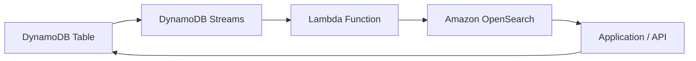
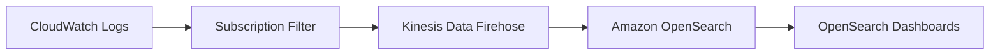

# Amazon OpenSearch

## 1. 소개

**Amazon OpenSearch Service**는 AWS 클라우드에서 대규모로 OpenSearch 클러스터를 배포, 보안, 운영하기 쉽게 만들어주는 완전관리형 서비스입니다. 원래 Amazon Elasticsearch Service로 출시되었으며, Elasticsearch 7.10에서 포크한 후 AWS가 오픈소스 OpenSearch 프로젝트를 채택하면서 Amazon OpenSearch Service로 리브랜딩되었습니다. 이 서비스는 로그 분석과 실시간 애플리케이션 모니터링부터 전문 검색과 보안 분석까지 광범위한 검색과 분석 사용 사례를 처리하도록 설계되었습니다.

## 2. Amazon OpenSearch의 핵심 개념

Amazon OpenSearch는 **OpenSearch**(데이터 인덱싱과 검색용), **OpenSearch Dashboards**(대화형 시각화용), **Logstash** 같은 선택적 로그 수집 도구 같은 구성 요소를 통해 분산 검색, 분석, 시각화 기능을 제공합니다.

* **운영 모드:**
	- **관리형 클러스터:** 인스턴스 유형, 노드 수, 스토리지 티어를 지정하며, AWS가 배후에서 서버의 프로비저닝과 유지보수를 처리하게 합니다.
	- **서버리스:** AWS가 클러스터 관리를 완전히 추상화해 사용량이 증가함에 따라 리소스를 자동으로 확장합니다. 이 옵션은 급증하거나 예측할 수 없는 트래픽을 가진 워크로드에 적합합니다.
* **OpenSearch Dashboards:**
	* 이전에는 Kibana로 알려졌던 OpenSearch Dashboards는 OpenSearch에 저장된 데이터를 시각화하기 위한 웹 인터페이스입니다. 더 고급 쿼리와 시각화를 제공함으로써 표준 AWS CloudWatch Dashboards를 넘어서는 실시간 차트, 지도, 다른 대시보드를 제공합니다.
* **Logstash:**
	* Logstash(그리고 더 넓은 Beats 생태계)는 OpenSearch에 저장하기 전에 데이터를 수집, 강화, 처리하는 데 사용될 수 있습니다. 많은 AWS 팀은 수집을 위해 Amazon Kinesis와 AWS Lambda 같은 네이티브 서비스를 선택하지만, Logstash는 여전히 인기 있고 유연한 대안으로 남아 있습니다.
## 3. 핵심 사용 사례

- **로그 분석:** 다양한 소스에서 거의 실시간으로 로그를 수집하고 분석합니다.
- **애플리케이션 모니터링:** 이상 징후를 탐지하고, 지표를 시각화하고, 성능 문제를 해결합니다.
- **보안 분석:** 중앙화된 로그를 통해 잠재적인 보안 위협을 조사합니다.
- **전문 검색:** 고급의 낮은 지연 시간의 키워드와 자연어 쿼리를 제공합니다.
- **클릭스트림 분석:** 웹사이트와 애플리케이션의 사용자 행동 데이터를 분석합니다.
- **인덱싱:** 신속한 조회를 위해 대량의 정형 또는 비정형 데이터를 수집합니다.
## 4. 일반적인 아키텍처 패턴

### 4.1. DynamoDB와 OpenSearch 통합

강력한 패턴 중 하나는 신속한 조회와 복잡한 텍스트 기반 검색을 위해 DynamoDB와 Amazon OpenSearch를 결합하는 것입니다. 일반적인 흐름은 다음과 같습니다.

1. **데이터 업데이트:** DynamoDB 테이블에서 삽입, 수정, 또는 삭제가 발생합니다.
2. **변경 스트림:** DynamoDB 스트림이 거의 실시간으로 이러한 변경 사항을 캡처합니다.
3. **Lambda 함수:** (DynamoDB 스트림을 구독하는) Lambda 함수가 이러한 변경 사항을 변환해 Amazon OpenSearch로 보냅니다.
4. **쿼리 레이어:** 애플리케이션이 OpenSearch를 쿼리해 고급 검색이나 분석을 수행한 다음, 필요하면 DynamoDB 테이블에서 가장 최신 레코드를 검색합니다.

이 패턴은 키-값 접근을 위한 DynamoDB의 확장성과 OpenSearch의 풍부한 전문 검색 기능을 결합합니다.

### 4.2. CloudWatch Logs 통합

조직은 운영 통찰과 보안 감사를 위해 중앙화된 로그 관리가 자주 필요합니다. Amazon OpenSearch는 CloudWatch Logs에서 거의 실시간으로 로그를 수집할 수 있습니다.

1. **로그 그룹:** (EC2, Lambda, 또는 커스텀 앱 같은) 서비스가 CloudWatch 로그 그룹으로 로그를 보냅니다.
2. **구독 필터:** 구독 필터가 이 로그들을 거의 실시간으로 대상으로 라우팅합니다.
3. **전달 메커니즘:** 로그는 Lambda 함수를 통해 직접 흐르거나, 필요에 따라 데이터를 배치 처리하고 변환할 수 있는 Amazon Kinesis Data Firehose를 통해 흐를 수 있습니다.
4. **Amazon OpenSearch:** 로그가 인덱싱되며 OpenSearch Dashboards를 통해 시각화될 수 있습니다.

## 5. 결론

Amazon OpenSearch는 실시간 로그, 애플리케이션 모니터링, 텍스트 기반 쿼리를 위한 견고한 검색과 시각화 기능을 제공함으로써 AWS의 분석 기능을 확장합니다. 비정형 데이터를 위한 간단한 검색 솔루션이 필요하든 운영 통찰을 위한 강력한 분석 도구가 필요하든, OpenSearch는 이 모든 것을 처리할 수 있습니다.

Amazon OpenSearch Service에 대한 가장 상세하고 최신 정보는 다음의 공식 자료를 참고하세요.

- **Amazon OpenSearch Service 제품 페이지:**
    [AWS 공식 페이지](https://aws.amazon.com/opensearch-service/)
    
- **Amazon OpenSearch Service 개발자 가이드:**
    [AWS 문서](https://docs.aws.amazon.com/opensearch-service/latest/developerguide/what-is.html)
