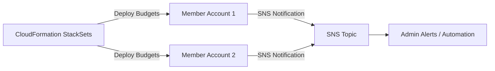

# AWS Budgets

## 1. 소개

AWS Budgets는 클라우드 지출을 선제적으로 모니터링하고 제어할 수 있게 해주는 핵심 AWS 비용 관리 도구입니다. 실제 비용, 사용량, 또는 예약 지표를 기반으로 커스텀 예산을 설정할 수 있게 해주며, 지출이나 사용량이 정의된 임계값을 초과하거나 초과할 것으로 예측될 때 알려줍니다.

## 2. 개요

AWS Budgets는 지출을 모니터링하고 제어할 수 있게 해주는 강력한 서비스입니다. 사용량, 비용, 예약, 또는 savings plan 같은 다양한 차원에 대한 예산을 정의하고, 실제 또는 예측된 사용량이 지정한 임계값을 초과할 때 알려주는 알림을 설정할 수 있습니다.

비용이나 사용량 예산에서 예산 금액을 초과하거나 초과할 것으로 예측될 때 경고하는 선택적 알림을 설정할 수 있습니다. 또는 RI나 Savings Plans 예산의 목표 활용률과 커버리지 아래로 떨어질 때도 마찬가지입니다. 알림을 Amazon SNS 토픽, 이메일 주소, 또는 둘 다로 보내도록 할 수 있습니다.

## 3. 예산 유형

다음 유형의 예산을 만들 수 있습니다.

- **비용 예산** – 서비스에 얼마나 지출하고 싶은지 계획합니다.
- **사용량 예산** – 하나 이상의 서비스를 얼마나 사용하고 싶은지 계획합니다.
- **RI 활용률 예산** – 활용률 임계값을 정의하고 RI 사용량이 그 임계값 아래로 떨어지면 알림을 받습니다. 이를 통해 RI가 사용되지 않거나 활용도가 낮은지 확인할 수 있습니다.
- **RI 커버리지 예산** – 커버리지 임계값을 정의하고 RI가 커버하는 인스턴스 시간 수가 그 임계값 아래로 떨어지면 알림을 받습니다. 이를 통해 인스턴스 사용량 중 얼마나 예약으로 커버되는지 확인할 수 있습니다.
- **Savings Plans 활용률 예산** – 활용률 임계값을 정의하고 Savings Plans 사용량이 그 임계값 아래로 떨어지면 알림을 받습니다. 이를 통해 Savings Plans가 사용되지 않거나 활용도가 낮은지 확인할 수 있습니다.
- **Savings Plans 커버리지 예산** – 커버리지 임계값을 정의하고 Savings Plans 대상 사용량 중 Savings Plans로 커버되는 것이 그 임계값 아래로 떨어지면 알림을 받습니다. 이를 통해 인스턴스 사용량 중 얼마나 Savings Plans로 커버되는지 확인할 수 있습니다.

## 4. 예산 작업(Budget Actions)

AWS Budgets를 사용해 예산이 특정 비용이나 사용량 임계값을 초과할 때 사용자를 대신해 작업을 실행할 수 있습니다. 이를 위해 임계값을 설정한 후, 자동으로 또는 수동 승인 후 실행되도록 예산 작업을 구성합니다.

사용 가능한 작업은 다음을 포함합니다.

* **IAM 정책 적용 또는 수정**: 특정 사용자, 그룹, 또는 역할이 특정 작업을 수행하지 못하도록 제한합니다.
- **서비스 제어 정책(SCP) 연결 또는 업데이트**: 전체 조직 단위(OU)에 제한을 부과합니다.
- **EC2나 RDS 인스턴스 중지**: 추가 비용을 방지하기 위해 실행 중인 인스턴스를 중지합니다.

동일한 알림 임계값에서 시작되도록 여러 작업을 구성할 수도 있습니다. 예를 들어 해당 월 예측 비용의 90%에 도달하면 자동으로 시작되도록 작업을 구성할 수 있습니다. 이를 위해 다음 작업을 수행합니다.

- 사용자, 그룹, 또는 역할이 추가 Amazon EC2 리소스를 프로비저닝할 수 있는 능력을 제한하는 커스텀 `Deny IAM` 정책을 적용합니다.
- `US East (N. Virginia) us-east-1`의 특정 Amazon EC2 인스턴스를 대상으로 지정합니다.
## 5. 중앙화된 예산 관리 vs. 분산된 예산 관리

### 5.1. 중앙화된 예산 관리

중앙화된 접근 방식에서는 관리 계정이 조직 내 모든 회원 계정의 예산을 제어합니다. 회원 계정의 AWS 청구 데이터를 대상으로 하는 필터를 적용해 관리 계정 내에서 회원 계정당 하나의 예산을 생성합니다.

1. **예산 생성**: 특정 회원 계정의 지출을 추적하기 위해 필터를 사용해 관리 계정에서 예산을 정의합니다.
2. **알림과 자동화**:
    - 임계값을 초과하면 SNS 토픽이 Lambda 함수로 알림을 보냅니다.
    - 그런 다음 함수는 예산을 초과한 회원 계정을 추가 리소스 프로비저닝을 방지하는 제한된 OU로 이동시킵니다.
    - 이 이벤트에 대한 가시성을 위해 관리자에게 이메일이나 메시지가 전송될 수 있습니다.

이 설정에서는 모든 예산이 관리 계정 수준에서 보이고 제어되어, 거버넌스와 중앙 감독을 단순화합니다.

### 5.2. 분산된 예산 관리

분산 모델에서는 각 회원 계정이 자체 예산을 호스팅합니다. 이 접근 방식은 개별 팀이나 부서가 자체 비용 임계값을 관리하도록 하고 싶을 때 유용합니다. AWS CloudFormation StackSets를 사용해 모든 회원 계정에 걸쳐 예산 배포를 간소화할 수 있습니다.

1. **예산 배포를 위한 StackSets**: 관리 계정에서 StackSet을 사용해 각 회원 계정에 AWS Budgets를 자동으로 생성하고 구성합니다.
2. **알림과 작업**: 중앙화된 관리와 유사하게 각 회원 계정은 임계값이 초과될 때 비용이 많이 드는 리소스를 중지하기 위한 알림과 자동화된 작업을 트리거할 수 있습니다.

이 접근 방식은 책임을 분산해, 각 팀이 전반적인 조직 정책을 계속 준수하면서 자체 비용을 관리할 수 있게 해줍니다.

## 6. 더 넓은 비용 관리 전략에서의 통합

AWS Budgets는 AWS의 전체적인 비용 관리 프레임워크의 필수적인 구성 요소이며, 종종 다음과 함께 사용됩니다.

- **AWS Cost Explorer:** 비용 추세를 시각화하고 지출 패턴을 분석하기 위해.
- **AWS Cost and Usage Report:** 상세한 청구 데이터에 접근하기 위해.
- **클라우드 재무 관리 모범 사례:** 투명한 비용 계획, 측정, 최적화를 위해 AWS Budgets 같은 도구 사용을 권장하는 AWS Cloud Adoption Framework에 설명된 대로.

## 7. 가격 정책 고려 사항

AWS Budgets는 비용 관리에 도움이 되도록 설계되었지만, 자체 가격 정책 모델도 가지고 있습니다. 일반적으로 무료 티어를 넘어서는 알림 통지당 소액의 요금을 지불해 — 지속적인 모니터링의 혜택을 누리면서 비용을 최소한으로 유지할 수 있습니다. 최신 가격 정책 세부 사항은 공식 AWS Budgets 가격 정책 페이지를 참고하세요.
## 8. 결론

AWS Budgets는 AWS 지출을 모니터링, 예측, 제어하기 위한 견고하고, 유연하고, 통합된 솔루션을 제공합니다. 커스텀 예산을 설정하고 선제적인 알림을 활용함으로써 비용 규율을 시행하고 클라우드 환경 전반에서 지속적인 비용 최적화를 이끌 수 있습니다. 다른 AWS 비용 관리 도구와 결합되면 AWS Budgets는 전체적인 클라우드 재무 관리 전략의 핵심 기둥을 형성합니다.

더 심층적인 세부 사항은 AWS Budgets를 사용해 비용 최적화 행동을 이끌고 선제적인 클라우드 재무 관리 전략을 지원하는 것의 중요성을 강조하는 "[Laying the Foundation: Setting Up Your Environment for Cost Optimization](https://docs.aws.amazon.com/pdfs/whitepapers/latest/cost-optimization-laying-the-foundation/cost-optimization-laying-the-foundation.pdf)" 같은 AWS 백서를 읽어보세요.
