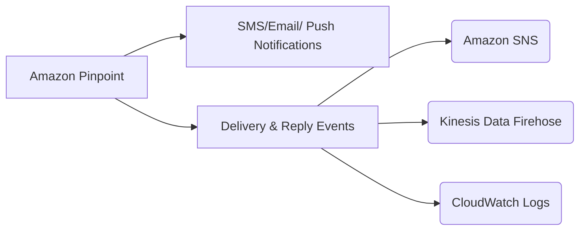

# Amazon Pinpoint

## 1. 소개

Amazon Pinpoint는 고객 참여와 타겟 메시징을 위해 설계된 완전관리형 AWS 서비스입니다. 조직이 이메일, SMS, 푸시 알림, 인앱 메시지, 음성 메시지를 포함한 여러 채널을 통해 고객과 소통하고 캠페인 성능과 사용자 행동에 대한 깊은 통찰을 얻을 수 있게 해줍니다. 유연한 API, 견고한 콘솔, 풍부한 SDK 지원을 통해 Amazon Pinpoint는 트랜잭션 및 마케팅 캠페인을 계획, 실행, 분석하기 더 쉽게 만들어줍니다.
## 2. 핵심 기능과 역량

### 2.1. 다중 채널 메시징

- **이메일, SMS, 음성:** 이메일과 SMS 같은 채널을 통해 (주문 확인, 비밀번호 재설정 등) 트랜잭션 메시지와 마케팅 캠페인을 보낼 수 있습니다. SMS와 음성 메시징의 경우 Pinpoint는 전용 API와 광범위한 채널 구성 옵션을 제공합니다.

- **푸시와 인앱 알림:** 전통적인 채널 외에도 Pinpoint는 모바일 푸시 알림과 인앱 메시징을 지원해, 사용자의 장치에서 직접 참여를 유도하는 데 사용될 수 있습니다.

### 2.2. 사용자 세그멘테이션과 타겟팅

- **동적 세그멘테이션:** Amazon Pinpoint는 사용자 속성, 행동, 참여 이력을 기반으로 동적 세그먼트를 정의하고 구축할 수 있게 해줍니다. 이는 고도로 타겟화된 메시징 전략을 가능하게 합니다.

- **여정 오케스트레이션:** 서비스의 Journey 기능을 사용하면 실시간으로 사용자 작업에 반응하는 자동화된 다단계 커뮤니케이션 워크플로를 설계할 수 있습니다.

### 2.3. 캠페인 관리와 분석

- **캠페인 예약과 개인화:** 특정 시간에 실행되도록 캠페인을 예약하고, 개인화된 콘텐츠로 메시지를 맞춤화하고, 커스텀 속성을 커뮤니케이션에 통합할 수도 있습니다.
- **이벤트 추적과 보고:** Amazon Pinpoint는 메시지 전달, 열람, 클릭, 다른 참여 지표에 대한 데이터를 자동으로 수집합니다. 이 데이터는 상세한 대시보드를 통해 사용할 수 있으며 Amazon Kinesis 같은 서비스를 통해 커스텀 분석을 위해 스트리밍될 수 있습니다.

## 3. 핵심 사용 사례
Pinpoint는 다음을 포함한 다양한 시나리오에 적합합니다.

- **대용량 마케팅 캠페인:** 대규모 고객 세그먼트에 프로모션이나 뉴스레터를 대량 발송합니다.
- **트랜잭션 알림:** 주문 확인, 배송 업데이트, 또는 비밀번호 재설정 안내를 보냅니다.
- **다중 채널 참여:** SMS, 이메일, 푸시 알림 등에 걸쳐 일관된 메시지를 조율합니다.
- **실시간 분석과 피드백 루프:** 메시지 이벤트를 외부 서비스로 스트리밍해 후속 조치를 트리거하거나 대시보드를 유지합니다.

## 4. 아키텍처와 이벤트 흐름

Amazon Pinpoint를 사용해 메시지를 보낼 때 (전달 확인이나 고객 응답 같은) 각 이벤트는 Amazon SNS, Amazon Kinesis Data Firehose, Amazon CloudWatch Logs로 라우팅될 수 있어, 견고한 데이터 수집과 분석 파이프라인을 가능하게 합니다.

아래는 메시지 이벤트가 Pinpoint를 통해 다양한 AWS 서비스로 흐르는 방식을 보여주는 개념적 다이어그램입니다.

이 통합을 통해 자동화되고 이벤트 기반인 워크플로를 만들 수 있습니다. 예를 들어 수신자가 SMS 메시지를 성공적으로 받으면 Pinpoint는 Amazon SNS 토픽으로 알림 이벤트를 보낼 수 있으며, 이는 다운스트림 처리나 분석을 트리거할 수 있습니다.

## 5. Amazon SNS와 Amazon SES와의 비교

Amazon SNS와 Amazon SES도 메시징 기능을 제공하지만, 캠페인이 관리되는 방식에서 Amazon Pinpoint와 상당히 다릅니다.

- **Amazon SNS와 Amazon SES:** 자체 애플리케이션 코드 내에서 대상 청중 세그멘테이션, 메시지 개인화, 전달 예약을 위한 로직을 처리해야 합니다.
- **Amazon Pinpoint:** 메시지 배포에 대한 더 상위 수준의, 캠페인 지향적인 접근 방식을 제공합니다. 타겟 세그먼트를 정의하고, 재사용 가능한 메시지 템플릿을 만들고, 전달 일정을 설정하면서 Pinpoint가 전체 오케스트레이션 프로세스를 관리하도록 할 수 있습니다.

정교한 세그멘테이션, 자동화, 분석이 포함된 대용량 캠페인을 관리하는 것이 목표라면 Amazon Pinpoint가 일반적으로 더 적합한 선택입니다. 그러나 광범위한 캠페인 관리가 필요하지 않은 더 단순한 알림 워크플로의 경우 Amazon SNS와 Amazon SES로 충분할 수 있습니다.

## 결론

Amazon Pinpoint는 복잡한 다중 채널 마케팅 노력을 시작하고 대용량, 고빈도 커뮤니케이션을 자동화하려는 조직에게 강력한 선택입니다. 견고한 세그멘테이션, 캠페인 관리, 자동화된 이벤트 라우팅 기능을 통해 Pinpoint는 표준 메시징 솔루션이 제공하는 것을 넘어섭니다. Amazon SNS, Amazon Kinesis Data Firehose, Amazon CloudWatch Logs와 원활하게 통합함으로써, 핵심 마케팅과 트랜잭션 지표에 대한 완전한 가시성을 유지하면서 올바른 대상에게 올바른 시간에 올바른 메시지를 전달하는 정교하고 이벤트 기반인 아키텍처를 구축할 수 있습니다.

더 포괄적인 세부 사항은 [공식 문서](https://aws.amazon.com/pinpoint/?nc=sn&loc=0)를 참고하세요.
